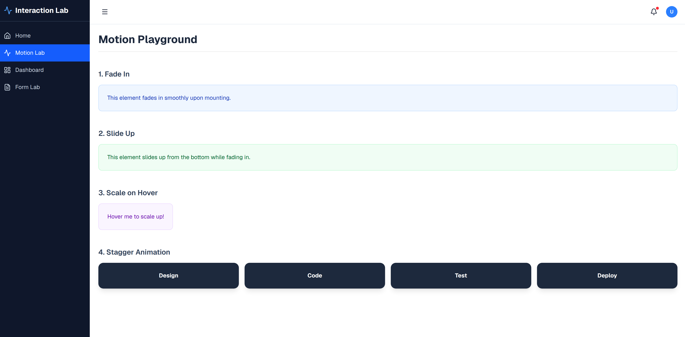

# Frontend Interaction Lab

A modern React 19 laboratory for exploring advanced frontend interactions, animations, and data visualizations. This project serves as a playground for implementing high-performance, accessible, and visually stunning user interfaces.



## 🚀 Technologies

- **Framework:** React 19 with TypeScript
- **Build Tool:** Vite
- **Styling:** Tailwind CSS 4.0
- **Animations:** Framer Motion (Motion)
- **State Management:** Zustand
- **Data Fetching:** TanStack Query (React Query)
- **Data Visualization:** Plotly.js / React-Plotly
- **Form Management:** React Hook Form + Zod
- **UI Components:** Shadcn/UI (Radix UI)
- **Routing:** React Router 7

## ✨ Key Features

### 1. 🎭 Motion Lab
Interactive animation playground showcasing:
- Staggered entry animations
- Scale-on-hover effects
- Smooth page transitions
- Gesture-based interactions

### 2. 📊 Analytics Dashboard
Comprehensive data visualization featuring:
- **Weekly Progress:** Line charts for performance tracking.
- **Skill Distribution:** Bar charts showing technical proficiency.
- **Package Usage:** Pie charts analyzing dependency distribution.

### 3. 📝 Form Lab
Advanced form implementation focusing on:
- Real-time validation with Zod.
- Complex nested data structures.
- Dynamic field arrays.
- Performance-optimized inputs.

### 4. 🧩 Component Gallery
A collection of reusable, atomic UI components built with accessibility and customization in mind.

## 🛠️ Getting Started

### Prerequisites

- Node.js (Latest LTS recommended)
- npm or pnpm

### Installation

1. Clone the repository:
   ```bash
   git clone https://github.com/Justin21523/frontend-interaction-lab.git
   ```

2. Install dependencies:
   ```bash
   npm install
   ```

3. Start the development server:
   ```bash
   npm run dev
   ```

## 🏗️ Project Structure

```text
src/
├── api/          # API integration layer
├── app/          # Router and core app logic
├── components/   # Reusable UI components
│   ├── charts/   # Plotly chart components
│   ├── layout/   # Page layouts (Sidebar, Header)
│   ├── motion/   # Framer Motion wrappers
│   └── ui/       # Atomic UI elements (Shadcn)
├── features/     # Feature-based modules
├── hooks/        # Custom React hooks
├── lib/          # Utilities and configurations
├── stores/       # Zustand state stores
└── types/        # TypeScript definitions
```

---

Developed with ❤️ by [Justin](https://github.com/Justin21523)
